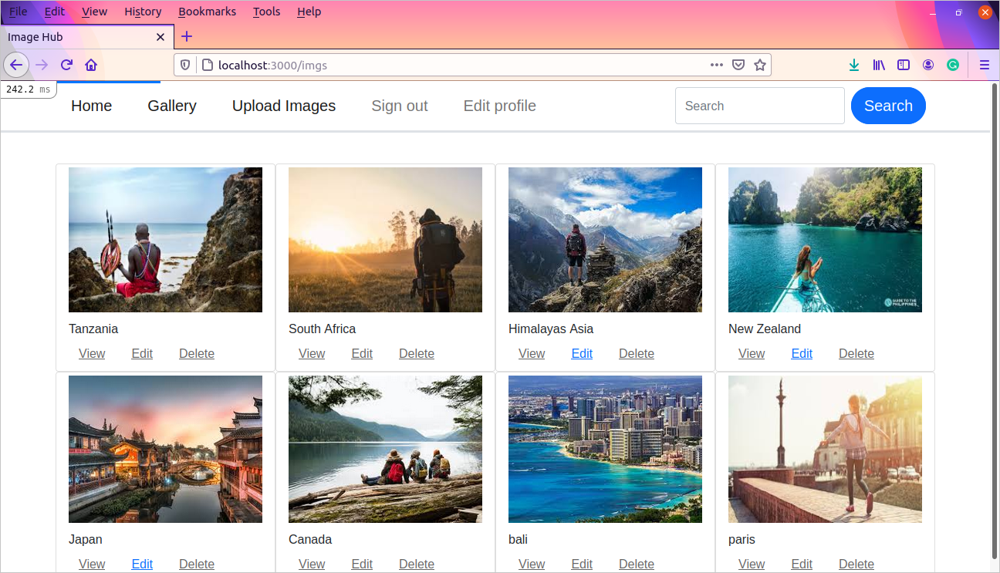

# Image Repository App

This is an Image Repository App built with Ruby on Rails. The App is called Image Hub and is a phone sharing platform. It is to help people experince new places through photos. search for Images of places you may want to travel and also share your own images and add a location in the caption.
You may only Edit or Delete images if you are the one who posted it.

Additional description of the project and its features.

## Built With

- Ruby
- Ruby on Rails

### Setup

- To use the application, please clone the repository to your local computer `git@github.com:Stephanie041996/Image_Repository.git` then cd to directory `cd Image_Hub
- Use `bundle install` to receive gems required for this project
- Use `yarn` to receive all the JavaScript packages for this project
- Run `rails db:setup` to create the database, run migration files, and install some sample data
- Activate your rails server by running the command `rails s`

### Usage
- Open the application in your browser. Usually, it is at `http://localhost:3000/`
- Sign up for a new user account and upload your images

## AUTHOR
**Stephanie Sakuhuni**

- GitHub: [@stephanie041996](https://github.com/Stephanie041996)
- LinkedIn: [Stephanie Sakuhuni](www.linkedin.com/in/stephanie-michelle-sakuhuni) 

## 🤝 Contributing

Contributions, issues, and feature requests are welcome!

Feel free to check the [issues page](https://github.com/Stephanie041996/Image_Repository/issues).

## Show your support

Give a ⭐️ if you like this project!

## 📝 License

- This project is [MIT] licensed.

